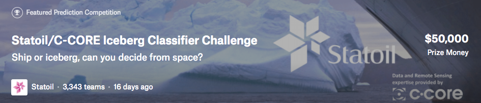

*This is my capstone project #1 in Springboard. And this is a on-going [Kaggle competition](https://www.kaggle.com/c/statoil-iceberg-classifier-challenge) when I worked on this project.*

There is the link for the full report: [Link](https://github.com/yaqiongz/aws/blob/master/FinalReport/FinalR_AWS.ipynb)

### The problem:

### The data:

### The model:

### Acknowledgements: 
I would like to thank my mentor Aaron for his help, such as giving me suggestions what model to use, explaining CV to me, helping connecting with AWS and giving me suggestions for future work (building machine learning framework, building data pipeline, connecting with available API, etc.). 

I also want to thank the community in Kaggle. The most important part of my learning so far is reading and understing others' code. For example, some of the code are built nicely with structured functions, and some of them have used neat sytax for a perticular line of code. I wouldn't build my python skills as fast if I didn't read those nice posts in Kaggle kernels.

 
